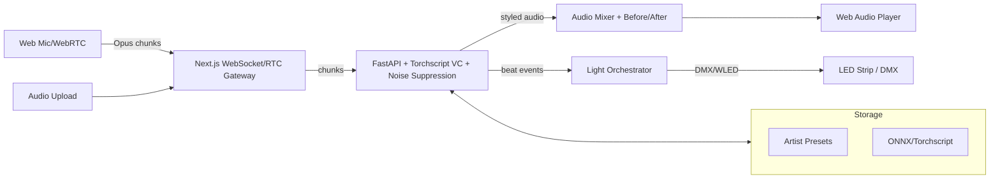

# AI Karaoke Remixer

Gerçek zamanlı karaoke deneyimini stil transferi, otomatik ışık koreografisi ve düşük gecikmeli web akışıyla birleştiren eğlenceli demo projesi. Portföy odaklıdır: hem ML hem sistem tasarımı hem de frontend UX kaslarını gösterir.

## Özellikler (MVP)
- Canlı ses girişi (mikrofon veya dosya yükleme), VAD ile chunked stream işleme
- Gürültü giderme + otomatik tonalite düzeltme
- Seçilebilir sanatçı timbre preset’leriyle ses stil transferi (VC)
- Beat/onset algısı ve buna göre otomatik LED/DMX ışık koreografisi üretimi
- Web arayüzünde düşük gecikmeli dinleme (WebRTC/WebAudio) ve ışık önizleme
- “Before/After” karşılaştırmalı playback

## Teknik Mimari


## Stack Seçimi
- Frontend: Next.js + TypeScript, WebRTC/WebAudio, Tailwind (veya vanilla) + üç panel UI
- Backend: FastAPI (Python), Torch/Torchscript veya ONNX Runtime; librosa/essentia ile ritim analizi
- Messaging: WebSocket (REST sadece ayarlar için), Redis queue (opsiyonel)
- Model: Pretrained voice conversion (Diffusion veya AutoVC varyantı), HiFi-GAN vocoder
- DevOps: Docker Compose; GPU varsa CUDA, yoksa CPU fall-back ve daha düşük kalite modu

## Dizin Taslağı
- `frontend/` – Next.js uygulaması, canlı dalga formu, preset seçici, ışık önizleme
- `backend/` – FastAPI servisi, inference pipeline, beat detection, WebSocket endpointi
- `models/` – İndirilmiş/quantize modeller, sanatçı preset config’leri
- `lights/` – WLED/DMX prototip skriptleri, JSON koreografi çıktıları
- `docs/` – Teknik notlar, blog post taslağı, demo scripti

## MVP Yol Haritası (2 Sprint)
1. Altyapı: Repo skeletonu, Docker Compose, basit healthcheck API, WebSocket echo, frontend canlı mikrofon + waveform
2. Ses işleme: Noise suppression + pitch correction pipeline; chunked streaming; latency ölçümü (hedef <400 ms RTT)
3. Stil transferi: Tek sanatçı preset’iyle inference; Torchscript/ONNX hızlandırma; before/after A/B player
4. Ritim & ışık: Beat/onset çıkarımı; ışık pattern JSON üretimi; frontend’de görsel önizleme
5. Demo parlaklığı: 3 sanatçı preset’i, kayıt/indirme, minik blog postu + demo videosu

## Stretch Fikirleri
- Kullanıcıdan kısa referans örnekle kişisel voice clone (etiketli uyarı + rate limit)
- Karaoke lyrics eşleştirme ve ekranda takip
- Mobil PWA + yerel gürültü giderme (WebAssembly RNNoise)
- Model sunumu için serverless CPU modu (Nitro/Edge) ve GPU modu seçici

## Çalıştırma (taslak)
```bash
docker compose up --build
# Frontend: http://localhost:3000
# Backend: http://localhost:8000
```

## Demo Senaryosu
1. “Before/After” butonuna basarak stil transferinin etkisini göster.
2. Farklı sanatçı preset’lerini seç; LED önizlemesi ritme göre renk değiştiriyor.
3. Geçikme ölçerle ~300-400 ms roundtrip değerini göster.

## Notlar
- GPU yoksa kalite düşürülmüş düşük parametreli modelle de çalışabilecek şekilde hedefleniyor.
- Her cevapta kaynak (preset, model versiyonu) ve parametre loglaması yapılacak; demo için güvenilirlik vurgusu.

